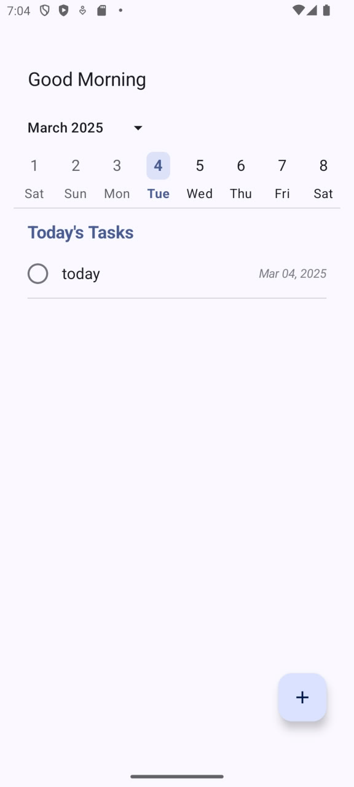

# 🚀 Tasko

## Where Tasks Go to Get Done (Eventually)

> "To-do lists are just a conspiracy by productivity gurus to make us feel bad about our Netflix habits." — Probably someone famous

Tasko is a modern Android task management application built with Jetpack Compose and following clean architecture principles. It's for people who want to organize their tasks beautifully, or at least have a pretty place to store the tasks they'll inevitably procrastinate on.

## ✨ Features

- **Elegant UI** - Built entirely with Jetpack Compose, because XML layouts are so 2020
- **Local Storage** - All your procrastination safely stored with Room database
- **Clean Architecture** - So clean you could eat off it (please don't)

## 🏗️ Architecture

Tasko follows the Clean Architecture pattern and MVI (Model-View-Intent) for the presentation layer:

```
com.yourusername.tasko
├── data/
│   ├── local/              # Room database, DAOs, entities
│   └── repository/         # Repository implementations
├── domain/
│   ├── model/              # Domain models
│   ├── repository/         # Repository interfaces
└── ui/
    ├── components/         # Screen components
    ├── viewmodels          # ViewModels
    └── screens             # screens
```

## 🛠️ Tech Stack

- **[Jetpack Compose](https://developer.android.com/jetpack/compose)** - Modern UI toolkit for native UI
- **[Room](https://developer.android.com/training/data-storage/room)** - SQLite object mapping library
- **[ViewModel](https://developer.android.com/topic/libraries/architecture/viewmodel)** - Store and manage UI-related data
- **[Kotlin Coroutines](https://kotlinlang.org/docs/coroutines-overview.html)** - For asynchronous programming
- **[Kotlin Flow](https://kotlinlang.org/docs/flow.html)** - Stream of data that can be computed asynchronously
- **[Koin](https://insert-koin.io/)** - Dependency injection

## 📱 Screenshots


## 🚦 Getting Started

### Prerequisites
- Android Studio Arctic Fox or later
- Android SDK 26+
- A genuine desire to be more productive (optional)

### Installation
1. Clone this repository
```bash
git clone https://github.com/Amirnlz/tasko.git
```

2. Open the project in Android Studio

3. Sync Gradle files and run the app

4. Start adding tasks you'll look at guiltily later

## 🧪 Testing

Because even procrastination apps need tests:

```bash
# Run unit tests
./gradlew test

# Run instrumented tests
./gradlew connectedAndroidTest
```

## 🤝 Contributing

1. Fork the Project
2. Create your Feature Branch (`git checkout -b feature/AmazingFeature`)
3. Commit your Changes (`git commit -m 'Add some AmazingFeature'`)
4. Push to the Branch (`git push origin feature/AmazingFeature`)
5. Open a Pull Request
6. Wait for reviewer to notice your PR (this might take longer than completing your tasks)


## 💭 Philosophical Corner

Remember, the to-do list is just a tool. The real productivity was the friends we made along the way.

---

<p align="center">Made with ☕ and existential dread</p>
